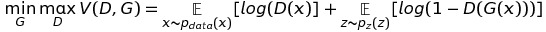

## GAN的原理
### 生成器
生成器用来生成图片
- 先初始化一个z，z的形状为 (batch_size, latent_dim)  
- 将z输入生成器中，输出的形状是：(batch_size, *image_size)  
- 计算生成器的损失，就是将这个生成的图片传入判别器，因为希望这个图是真的，所以target值全设置为1

### 判别器
判别器是用来判别图像是否为真
- 判别器有两个损失值
  - real_loss：判别真实图片，这时候希望能够判别为真
  - fake_loss：一个是判别生成图片，这时候希望判别为假

### 训练
最终希望达到的目标是real_loss和fake_loss，同时下降同时达到最小值，并且相差不大，这时候说明D差不多稳定了
  
- 初始的图像如下：  
  
- 生成的手写字如下：  
